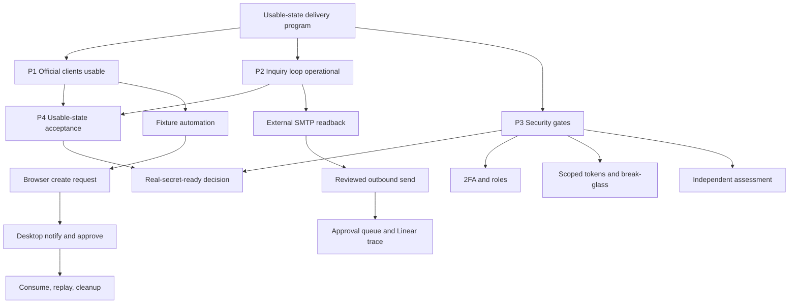

# HonoWarden Usable-State Implementation Plan

Status: active plan.  
Plan date: 2026-07-11.  
Planning horizon: 2026-07-11 through 2026-07-31.  
Linear source of truth: `HonoWarden Post-Alpha Roadmap`.

## Product Outcome

HonoWarden becomes usable in two explicit stages:

1. **Synthetic usable**: an operator can deploy HonoWarden, connect clean
   official browser and Desktop clients, perform the personal-vault lifecycle,
   use login-with-device, receive and review project inquiries, and recover
   from routine failures using synthetic data only.
2. **Real-secret ready**: Cloudflare operator access is hardened, legacy and
   break-glass credentials are retired or rotated, and an independent security
   assessment has no unresolved critical/high findings.

Synthetic usable must not be described as safe for real secrets. Real-secret
ready cannot be self-attested by the implementation agent.

Production is out of scope unless a separate issue explicitly authorizes the
target, change window, rollback, and post-change readback. This plan's runtime
evidence is collected against staging with synthetic data.

## Users And Jobs

- **Vault user**: connect an official client to a self-hosted endpoint and use a
  personal encrypted vault without server-side plaintext access.
- **Second device user**: approve login-with-device and continue after a lost or
  unavailable password entry path.
- **Project operator**: deploy, inspect, back up, restore, roll back, and clean
  synthetic state without copying secrets into commands or evidence.
- **Inquiry operator**: receive project mail, review AI-generated triage/drafts,
  approve outbound replies, and trace work into Linear without autonomous send.
- **Security assessor**: test a pinned staging build under explicit rules of
  engagement and return independently retestable findings.

## Definition Of Synthetic Usable

All conditions are required:

- official browser extension and Desktop clients log in to staging through a
  clean profile;
- empty sync and login-item create/update/delete/restore survive logout/login;
- a second client creates a login-with-device request, the approving client
  receives the notification, and one-time token consumption succeeds;
- notification failure still converges through authoritative polling;
- refresh rotation and replay rejection are observed in the client lifecycle;
- hidden inbound inquiry mail reaches the dedicated Worker, D1 metadata, and
  configured human inbox without raw-body retention;
- a human-approved synthetic outbound reply is sent once, audited, and proven
  duplicate-safe;
- backup/restore, rollback, cleanup, health, and foreign-key readbacks pass on
  the exact deployed commit;
- the website and security contact remain reachable;
- no real account, real vault data, personal destination, token, key, password
  hash, or encrypted payload appears in committed evidence.

## Definition Of Real-Secret Ready

Synthetic usable is complete, plus:

- all Cloudflare operators use required 2FA and broad administrator access is
  removed or explicitly time-bounded;
- scoped credentials cover normal operations and no-expiry legacy tokens are
  retired;
- the global-key break-glass path is rotated, stored under an approved recovery
  process, and exercised without becoming the default credential;
- an independent assessor executes the authorized staging assessment;
- every critical/high finding is remediated and independently retested, or has
  explicit owner risk acceptance with expiration and compensating controls;
- the final report or redacted attestation is linked from the security review
  index.

## Delivery Phases

### Phase 1: Reproducible Official-Client Workflows

Target: 2026-07-13.  
Linear milestone: `P1 - Official clients usable`.

Outcome: browser and Desktop personal-vault and login-with-device flows can be
rerun from clean profiles without ad hoc SQL or retained credentials.

Existing hierarchy:

- `HON-53` Desktop live evidence
  - `HON-66` notification transport - Done
  - `HON-67` clean-profile vault/item lifecycle
- `HON-63` trusted-device and login-with-device program
  - `HON-72` auth-request program
    - `HON-78` security contract - Done
    - `HON-79` persistence/API/token grant - Done
    - `HON-80` notifications and client evidence
      - `HON-84` durable notification delivery - Done
      - `HON-85` official Desktop/browser lifecycle
        - `HON-88` staging fixture/evidence CLI
- `HON-65` iOS live smoke, tracked separately from the browser/Desktop critical
  path because it requires a provisioned Apple run target.

Sub-issues to add under `HON-85`:

- prepare and clean the official browser-extension profile with pinned version;
- capture Desktop approval notification and browser token-consume evidence;
- record polling fallback, replay rejection, cleanup, and conservative matrix
  promotion.

Exit criteria:

- `HON-88`, `HON-67`, and all new `HON-85` evidence children are Done;
- browser and Desktop matrix rows link exact version/build evidence;
- fixture cleanup reports zero users, devices, refresh tokens, auth requests,
  orphan rows, and foreign-key violations;
- `HON-85`, `HON-80`, `HON-72`, and `HON-63` close bottom-up.

Rollback: clear the synthetic fixture, disable durable notifications in staging,
and leave polling/API compatibility intact.

### Phase 2: Inquiry Inbox Operational Loop

Target: 2026-07-16.  
Linear milestone: `P2 - Inquiry loop operational`.

Outcome: one inbound inquiry can become redacted AI triage, a reviewed draft,
an approved outbound reply, and a duplicate-safe Linear issue while a human
retains send authority.

Existing hierarchy:

- `HON-24` inbound mailbox implementation - Done
  - `HON-76` migrate hidden Email Routing smoke to dedicated Worker
- `HON-25` human-approved replies
  - `HON-68` deploy/send synthetic approved reply
- `HON-26` AI triage/draft generation - Done
- `HON-27` Linear workflow - Done

Sub-issues to add:

- external-SMTP hidden-route smoke with D1/event/human-inbox readback;
- public inquiry alias cutover plan with per-alias rollback and no destination
  disclosure;
- one approved outbound send with thread headers, send audit, and duplicate
  prevention;
- operator queue/status view for pending human approvals and failed sends.

Exit criteria:

- dedicated Worker receives external SMTP and records metadata-only state;
- configured human inbox receives the forwarded message;
- approved outbound test sends exactly once and records non-secret audit data;
- rejected/unapproved drafts cannot send;
- Linear creation remains duplicate-safe;
- routing rollback is tested without changing unrelated aliases;
- `HON-76`, `HON-68`, `HON-25`, and the phase epic close bottom-up.

Rollback: restore the previous Worker target for the affected rule, disable the
outbound binding/path, and preserve D1 evidence for incident analysis.

### Phase 3: Operator And Security Hardening

Target: 2026-07-24 for operator controls; external assessment target is set only
after an assessor is engaged.  
Linear milestone: `P3 - Security gates`.

Outcome: routine operations use scoped credentials and real-secret readiness is
decided from independent evidence.

Existing hierarchy:

- `HON-64` Cloudflare least-privilege remediation
  - `HON-73` operator 2FA and role reduction
  - `HON-74` legacy token retirement/global-key rotation
- `HON-57` independent security assessment
  - `HON-86` engagement pack - Done
  - `HON-87` commission and complete independent assessment

Sub-issues to add under `HON-73`/`HON-74`:

- inventory operator 2FA/role state and define a no-lockout change sequence;
- enforce 2FA and reduce broad roles with post-change readback;
- inventory legacy token owners/last use/expiration without exposing values;
- migrate each routine workflow to its scoped token;
- rotate break-glass credentials and conduct a recovery-only verification;
- remove obsolete local/global credential fallbacks.

Exit criteria:

- `HON-73` and `HON-74` pass control-plane readback;
- normal deploy/DNS/Email Routing/D1-R2/read-only workflows use scoped tokens;
- `HON-87` report is linked and critical/high findings satisfy retest policy;
- security docs state either real-secret ready or the exact unresolved blocker.

Rollback: preserve one tested, time-bounded emergency access path before role or
token removal; changes stop on any lockout or account ownership ambiguity.

### Phase 4: Usable-State Acceptance And Handoff

Target: 2026-07-31.  
Linear milestone: `P4 - Usable-state acceptance`.

Outcome: one evidence index shows what is usable, what remains synthetic-only,
and what blocks real-secret use.

Sub-issues to add:

- execute the full synthetic acceptance matrix against one pinned staging
  Worker version;
- test clean install/upgrade/rollback and backup/restore from the same commit;
- reconcile website, inquiry, client, operations, and security evidence links;
- publish an operator quickstart and explicit red/yellow/green capability table;
- run a final Linear audit: no parent Done while an active required child
  remains, and no orphan active issue lacks a milestone/parent.

Exit criteria:

- synthetic usable definition passes with direct evidence;
- real-secret-ready definition is either passed or visibly blocked by named
  issues;
- all active issues have a parent phase, milestone, owner/state, acceptance
  criteria, and next action;
- project update reports completed work, critical path, human gates, and links;
- rollback and synthetic cleanup readbacks are green.

## Dependency Graph

P1 and P2 may run in parallel. P4 requires both. P3 operator controls can run in
parallel, but the independent assessment must use a pinned feature-complete
staging build. Real-secret ready requires P3 and P4.

## Issue Design Rules

- A program/phase issue describes an outcome and closes only when every required
  child is Done or explicitly canceled with rationale.
- A sub-issue is one reviewable vertical slice: implementation, tests, runtime
  evidence, or one human/operator gate. Target size is one PR or one live
  operation.
- Every sub-issue has testable acceptance criteria, dependencies, rollback or
  cleanup, and an evidence destination.
- Implementation begins only after the relevant sub-issue exists and is In
  Progress.
- Completion requires PR/CI and runtime readback where behavior is deployed.
- Parent issues close bottom-up; parent status never hides active children.
- External/human gates are separate sub-issues rather than vague blockers in an
  otherwise implemented issue.

## Progress Reporting

Linear is authoritative. The `HonoWarden Post-Alpha Roadmap` project shows:

- milestone completion percentage;
- active program and phase hierarchy;
- priority ordered by the dependency graph;
- project updates with completed work, current critical path, human/external
  gates, next slices, and evidence links.

Repository `ROADMAP.md` summarizes product direction. This plan owns the current
execution sequence; issue comments own per-slice evidence.

## Free-Plan Issue Capacity

Current inventory on 2026-07-11: 88 total issues, 71 Done, 16 active, 0
archived. The 250-issue limit has 162 free slots, so no evidence-bearing Done
issue is archived now.

Capacity policy:

- below 200 total: retain Done issues for traceability;
- at 200: audit completed leaf issues older than the current release cycle;
- archive only Done leaf issues whose PR/CI/runtime evidence is linked from an
  active parent, project update, or repository evidence index;
- never archive active issues, unresolved security findings, current milestone
  parents, or the only copy of an operational decision;
- read back total/active/archived counts after each archive batch.

## Execution Loop

For each planned sub-issue:

1. confirm dependency and acceptance criteria;
2. move exactly one issue to In Progress;
3. reproduce or write a failing test/preflight;
4. implement the smallest complete vertical slice;
5. run focused and full gates;
6. create PR, wait for CI/review, and merge;
7. deploy or run the authorized live operation when required;
8. record redacted evidence and cleanup/rollback readback;
9. mark the sub-issue Done and reassess the parent/milestone;
10. select the next unblocked issue on the critical path.
