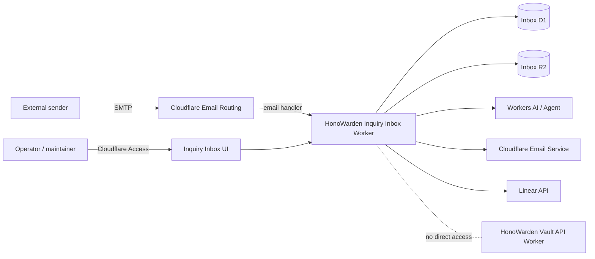
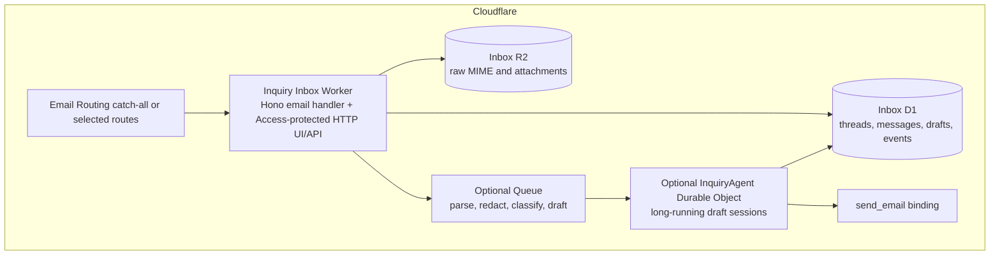
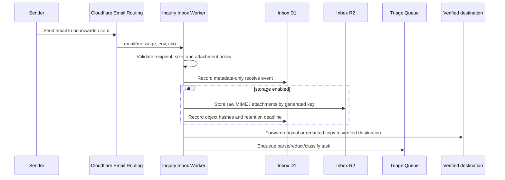
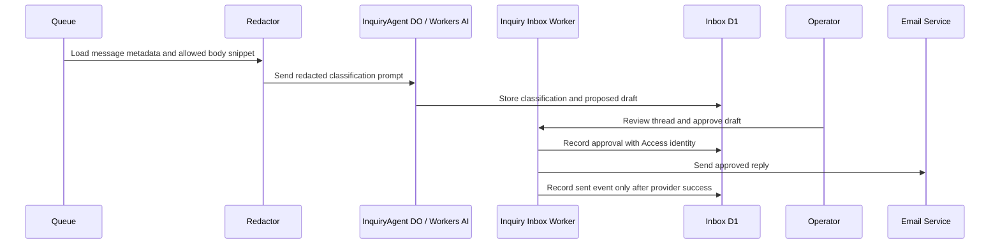

# AI Inquiry Inbox Architecture

Status: phase 1 metadata-only ingestion implemented; UI, AI triage, outbound
reply, raw MIME storage, attachment storage, and Linear automation remain
future phases.

This document defines the safe architecture for a HonoWarden contact,
support, and security inquiry inbox. It is intentionally narrower than a full
general-purpose webmail client.

## References

- User-provided field report:
  [Cloudflare に独自ドメインのメールクライアントを構築した](https://blog.sh1ma.dev/articles/20260706_cloudflare_agentic_inbox/)
- Cloudflare reference app:
  [cloudflare/agentic-inbox](https://github.com/cloudflare/agentic-inbox)
- Cloudflare product overview:
  [Email for Agents](https://blog.cloudflare.com/email-for-agents/)
- Cloudflare Agents email docs:
  [Email communication channel](https://developers.cloudflare.com/agents/communication-channels/email/)
- Cloudflare Email Service route handler docs:
  [Workers API for route emails](https://developers.cloudflare.com/email-service/api/route-emails/email-handler/)

## Decision

Build a HonoWarden-specific inquiry inbox Worker rather than importing the
whole Agentic Inbox application.

Agentic Inbox is a good reference for the Cloudflare-native shape: Email
Routing receives mail, Email Service sends replies, mailbox state can live in
Durable Objects with SQLite, attachments can live in R2, and an Agent can draft
replies. It is not a drop-in fit for HonoWarden because its own README states
that Cloudflare Access is the single trust boundary and there is no per-mailbox
authorization. HonoWarden needs a stricter security/support workflow:

- mailbox-level authorization for `security@`, `support@`, and `hello@`
- human approval before any external reply
- redaction and retention policy before storing message bodies or attachments
- no access from the inquiry inbox to the vault API D1 database, token secrets,
  or encrypted vault payloads
- Linear issue creation with redacted summaries instead of raw email content

The first implementation should live outside the vault API Worker blast radius.
It may be implemented in the website repository or a new inbox Worker
repository, but it must use separate Cloudflare bindings, secrets, and storage.
This repository remains the source of truth for the design, operations evidence,
and Linear tracking until a dedicated implementation repository exists.

## Context Diagram



The dotted line is a prohibition, not a dependency. The inquiry inbox must not
read or write HonoWarden vault tables, token secrets, or user encrypted data.

## Container Design



Recommended initial split:

| Component                   | Responsibility                                                               | Initial phase |
| --------------------------- | ---------------------------------------------------------------------------- | ------------- |
| Email handler               | Accept, reject, forward, and record inbound metadata.                        | HON-24        |
| Access-protected UI/API     | Review threads, drafts, and evidence without exposing raw secrets.           | HON-25        |
| Inbox D1                    | Canonical thread/message/draft/event index.                                  | HON-24        |
| Inbox R2                    | Optional raw MIME and attachment storage after retention policy is active.   | HON-24+       |
| Queue                       | Decouple SMTP event handling from parsing, redaction, AI, and Linear writes. | HON-26        |
| InquiryAgent Durable Object | Stateful AI drafting session and tool boundary, not canonical storage.       | HON-26        |
| Email Service binding       | Send approved replies only.                                                  | HON-25        |
| Linear adapter              | Create/update issues from redacted summaries after human approval.           | HON-27        |

Do not start with the full Agentic Inbox UI. Start with a compact operator
workflow for project contact, support, and security reports.

## Trust Boundaries

| Boundary                      | Input                                              | Required control                                                                                                            |
| ----------------------------- | -------------------------------------------------- | --------------------------------------------------------------------------------------------------------------------------- |
| Public SMTP to Email Routing  | Sender, recipient, headers, MIME body, attachments | Treat all fields as untrusted; enforce size and recipient allowlists before parsing.                                        |
| Email handler to storage      | Raw MIME, parsed text, attachment metadata         | Store metadata first; enable raw body and attachment persistence only after retention/deletion controls are implemented.    |
| Operator UI to inbox API      | Cloudflare Access JWT and browser requests         | Require Access in all shared environments; enforce mailbox-level roles after Access, not only Access policy membership.     |
| Inbox Worker to AI            | Redacted subject/body snippets and metadata        | AI receives minimum content needed for classification/drafting; attachments are not sent to AI by default.                  |
| Inbox Worker to Email Service | Approved draft and recipient                       | Send only a draft with an approval event tied to an Access identity.                                                        |
| Inbox Worker to Linear        | Redacted summary, labels, mailbox, status          | Never send raw MIME, attachment bodies, private destination addresses, or vulnerability details that should remain private. |
| Inbox Worker to Vault API     | None                                               | No direct binding, no shared D1, no shared token secret, no service token in phase 1.                                       |

Cloudflare Access is necessary but not sufficient. Access identifies the human
operator; the inbox must still enforce mailbox-level permissions. For example,
a maintainer who may handle `hello@` should not automatically see raw
`security@` reports.

## Data Model

The concrete schema can evolve in HON-24, but the first version should preserve
these invariants.

### D1 Tables

| Table                  | Purpose                                                                                       | Sensitive fields                                                                 |
| ---------------------- | --------------------------------------------------------------------------------------------- | -------------------------------------------------------------------------------- |
| `inquiry_threads`      | One row per conversation, keyed by mailbox and normalized thread reference.                   | sender hash, subject preview, classification, status, retention deadline         |
| `inquiry_messages`     | Inbound and outbound message metadata.                                                        | envelope sender hash, header hashes, size, body storage state, R2 key references |
| `inquiry_drafts`       | Human or AI draft replies.                                                                    | redacted draft body, model id, risk label, approval status                       |
| `inquiry_events`       | Append-only audit trail for receive, classify, draft, approve, send, reject, and Linear sync. | Access identity, action metadata, error code                                     |
| `inquiry_linear_links` | Redacted mapping between threads and Linear issues.                                           | issue id, issue url, sync status                                                 |

Store hashes for sender addresses and message ids when the exact value is not
needed for operator display. If exact sender addresses are displayed, keep them
out of logs and evidence files.

### R2 Objects

Object keys must be generated by the Worker, never by MIME filenames:

```text
inquiry/{env}/{mailbox}/{threadId}/{messageId}/raw.eml
inquiry/{env}/{mailbox}/{threadId}/{messageId}/attachments/{attachmentId}
```

Each object reference in D1 must include:

- generated object key
- SHA-256 hash
- byte size
- content type from parser output
- original filename only as redacted/display metadata
- retention deadline

Raw MIME and attachment storage starts disabled. Metadata-only ingestion plus
forwarding remains the default until an operator explicitly enables storage and
the deletion path is tested.

HON-24 implemented the first safe subset in this repository:

- `email(message, env, ctx)` is exported from the Worker entrypoint.
- Allowed recipients default to `security`, `support`, `hello`, `admin`,
  `postmaster`, and `abuse` on `honowarden.com`.
- `migrations/0011_inquiry_inbox.sql` creates `inquiry_threads`,
  `inquiry_messages`, and `inquiry_events`.
- The handler records sender/message header hashes, public recipient, subject
  preview, raw size, content type, attachment hint, delivery status, and
  retention deadline.
- The handler does not read `message.raw`, does not persist raw body content,
  and rejects attachment-like messages while attachment storage is disabled.
- Forwarding uses `HONOWARDEN_INQUIRY_FORWARD_TO` only when a verified
  destination is configured outside tracked files.
- Metadata is persisted before forwarding. If storage fails, the handler fails
  before forwarding so Cloudflare can retry without creating an untracked
  operator-visible delivery. If the post-forward status update fails, the
  handler logs a structured error and returns success to avoid duplicate
  forwards.

## Inbound Flow



Failure mode: if initial metadata persistence fails, the Worker must fail before
forwarding so retry does not duplicate an operator-visible message. Once
forwarding has succeeded, post-forward status update failures are logged and
not rethrown because rethrowing would ask Cloudflare to retry an already
forwarded email. The Worker must not send an auto-reply that claims successful
case creation when storage or triage failed.

## Triage And Draft Flow



AI may classify, summarize, draft replies, suggest labels, and propose a Linear
issue body. AI must not send external email, close a security report, delete a
thread, or create a Linear issue without an explicit policy allowing that
specific action. The default policy is human approval required for all external
writes.

## Linear Integration

HON-27 should implement Linear integration as a separate adapter:

- AI or rules can propose issue title, labels, priority, and description.
- The proposed body must be redacted and must not include raw message bodies,
  attachments, private destination addresses, or exploit details that should
  stay in the private inbox.
- Human approval is required before `issueCreate`.
- The adapter stores Linear issue id, URL, sync status, and last error.
- Closing or resolving a Linear issue must not automatically delete inbox data.

## Retention And Redaction

Default policy before production use:

- evidence files may contain timestamps, route names, message ids or hashes, and
  redacted delivery status only
- no real vulnerability report, customer secret, raw MIME body, or attachment
  content may be pasted into Linear, GitHub, docs, logs, or chat
- raw MIME and attachments are disabled until delete tooling and retention
  evidence exist
- metadata and audit events retain for 365 days unless a shorter project policy
  is approved
- when raw body storage is enabled, `hello@` and `support@` raw content should
  default to 30 days after close; `security@` may retain longer only with an
  explicit incident-response policy

Deletion must be idempotent and auditable: deleting an R2 object without
clearing the D1 reference, or clearing the reference without deleting the object,
is an incomplete deletion.

## Configuration

The implementation Worker needs separate configuration from the vault API:

| Binding or setting                 | Purpose                                              | Secret?                       |
| ---------------------------------- | ---------------------------------------------------- | ----------------------------- |
| `INQUIRY_DB`                       | inbox D1 tables                                      | no, but environment-specific  |
| `INQUIRY_OBJECTS`                  | raw MIME and attachments                             | no, but sensitive data store  |
| `EMAIL`                            | outbound Email Service binding                       | no secret value in repo       |
| `HONOWARDEN_INQUIRY_MAILBOXES`     | allowed local parts and mailbox roles                | operationally sensitive       |
| `HONOWARDEN_INQUIRY_DOMAINS`       | accepted recipient domains                           | no, but environment-specific  |
| `HONOWARDEN_INQUIRY_FORWARD_TO`    | verified forwarding destination                      | operationally sensitive       |
| `HONOWARDEN_INQUIRY_MAX_RAW_BYTES` | inbound size cap before metadata persistence         | no                            |
| `POLICY_AUD` / `TEAM_DOMAIN`       | Cloudflare Access validation when implemented in-app | secret or Worker secret       |
| `LINEAR_API_KEY`                   | Linear issue adapter                                 | secret; write scope minimized |
| AI binding/model config            | classification and draft generation                  | no secret value in repo       |

Do not reuse `HONOWARDEN_TOKEN_SECRET`, `HONOWARDEN_TOTP_SECRET`, or the vault
API D1 binding in the inbox Worker.

## Phased Implementation Map

| Linear issue | Implementation boundary                                                                                                                 |
| ------------ | --------------------------------------------------------------------------------------------------------------------------------------- |
| HON-24       | Email handler, metadata-only D1 ingestion, generated R2 object references, retention flags, tests for reject/forward/storage-off paths. |
| HON-25       | Access-protected operator review surface, draft approval records, Email Service send path, sent-event readback.                         |
| HON-26       | AI triage and draft generation with redaction, prompt/version tracking, model failure states, no autonomous send.                       |
| HON-27       | Human-approved Linear issue creation/update from redacted summaries.                                                                    |
| HON-28       | Public security contact metadata only after inbound route, destination verification, and smoke evidence pass.                           |

## Rollback

Rollback must be possible without affecting the vault API:

1. Disable the Email Routing rule that targets the inbox Worker, or switch back
   to forwarding-only rules.
2. Disable outbound `send_email` binding or remove the sending route from the
   operator UI.
3. Suspend queue consumers and AI draft jobs.
4. Preserve D1/R2 data for incident review until retention/deletion policy says
   otherwise.
5. Record rollback state in `docs/release/email-routing-evidence.md` without
   message bodies or attachments.

## Open Questions

- Whether the implementation belongs in `HonoWarden-website` or a separate
  `HonoWarden-inquiry-inbox` repository.
- Whether Cloudflare Access JWT validation should be enforced only at the route
  level or also verified in the Worker for audit identity binding.
- Exact retention periods for `security@` reports once real vulnerability
  reports are accepted.
- Whether low-risk `hello@` acknowledgments may become autonomous after live
  evidence, or whether every outbound message remains approval-gated.
